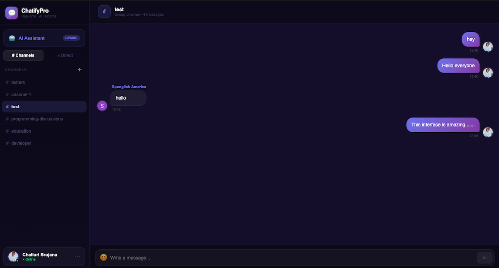
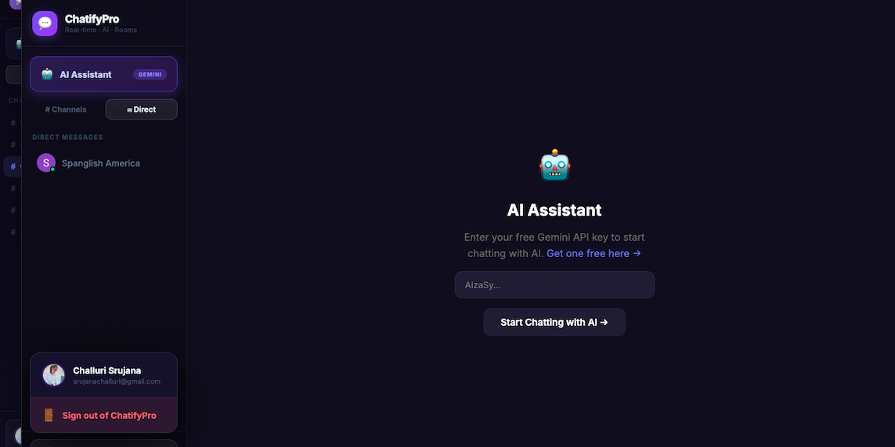
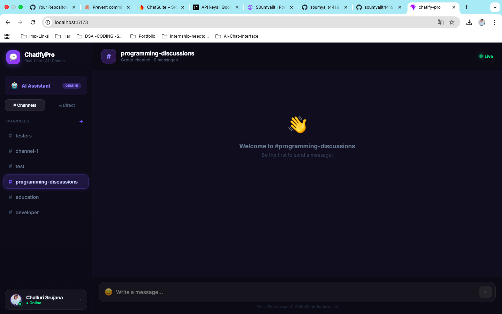
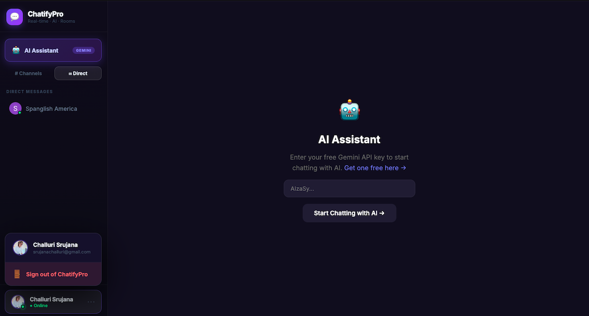
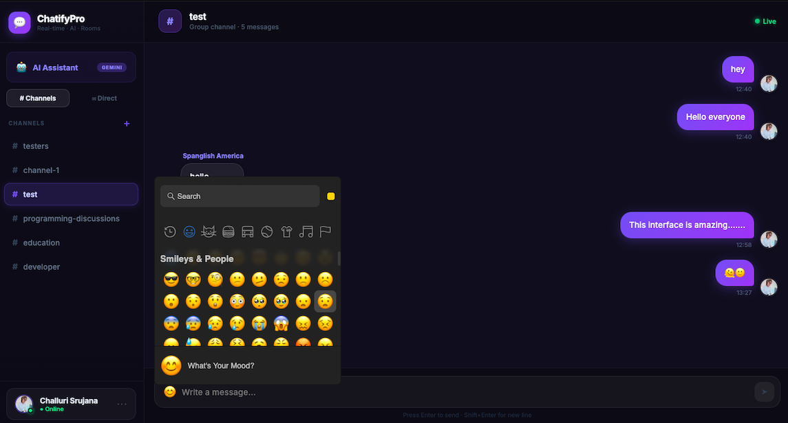

# 💬 ChatifyPro

> A modern, real-time chat application with AI integration, group rooms, and direct messaging — built with React and Firebase.

[](https://your-app-name.vercel.app)
[](https://react.dev)
[](https://firebase.google.com)
[](https://vercel.com)

---

## ✨ Features

- 🔐 **Google Authentication** — One-click sign in, no passwords
- 🏠 **Group Chat Rooms** — Create and join #channels, chat in real-time
- ✉️ **Direct Messages** — Private 1-on-1 conversations
- ⚡ **Real-time Messaging** — Powered by Firebase Firestore
- 😊 **Emoji Reactions** — React to any message with 6 emotions
- 🤖 **AI Assistant** — Built-in Gemini AI chat (users bring their own free key)
- 🎨 **Modern Dark UI** — Glassmorphism design with smooth animations
- 📱 **Responsive** — Works on all screen sizes

---

## 🖼️ Screenshots

> _(Add your screenshots here after deployment)_

| Login                      | Chat Room              | AI Assistant         |
| -------------------------- | ---------------------- | -------------------- |
|  |  |  |

---

| Channels                      | email                     | Emoji                   |
| ----------------------------- | ------------------------- | ----------------------- |
|  |  |  |

---

## 🛠️ Tech Stack

| Layer      | Technology                             |
| ---------- | -------------------------------------- |
| Frontend   | React 18 + Vite                        |
| Styling    | Inline styles + CSS animations         |
| Auth       | Firebase Authentication (Google OAuth) |
| Database   | Firebase Firestore (real-time)         |
| AI         | Google Gemini API (user-provided key)  |
| Animations | CSS keyframes + spring physics         |
| Deployment | Vercel                                 |

---

## 🚀 Getting Started

### Prerequisites

- Node.js v16+
- A Firebase project
- A Google Cloud OAuth app

### 1. Clone the repository

```bash
git clone https://github.com/YOUR_USERNAME/chatify-pro.git
cd chatify-pro
```

### 2. Install dependencies

```bash
npm install
```

### 3. Set up Firebase

1. Go to [Firebase Console](https://console.firebase.google.com/)
2. Create a new project
3. Enable **Authentication** → Google provider
4. Enable **Firestore Database** → Start in test mode
5. Go to Project Settings → Add web app → copy config

### 4. Create `.env` file

```env
VITE_FIREBASE_API_KEY=your_api_key
VITE_FIREBASE_AUTH_DOMAIN=your_project.firebaseapp.com
VITE_FIREBASE_PROJECT_ID=your_project_id
VITE_FIREBASE_STORAGE_BUCKET=your_project.appspot.com
VITE_FIREBASE_MESSAGING_SENDER_ID=your_sender_id
VITE_FIREBASE_APP_ID=your_app_id
```

### 5. Set Firestore Rules

In Firebase Console → Firestore → Rules:

```
rules_version = '2';
service cloud.firestore {
  match /databases/{database}/documents {
    match /{document=**} {
      allow read, write: if request.auth != null;
    }
  }
}
```

### 6. Run locally

```bash
npm run dev
```

Open [http://localhost:5173](http://localhost:5173)

---

## 🤖 AI Chat Setup

Each user enters their own free Gemini API key — this means **zero quota issues** for you as the developer.

Users can get a free key at: [aistudio.google.com/app/apikey](https://aistudio.google.com/app/apikey)

The key is stored in the user's browser `localStorage` — never sent to any server.

---

## 📁 Project Structure

```
chatify-pro/
├── src/
│   ├── components/
│   │   ├── Auth/
│   │   │   └── Login.jsx          # Google sign-in page
│   │   ├── Sidebar/
│   │   │   └── Sidebar.jsx        # Navigation + user profile
│   │   ├── Chat/
│   │   │   ├── ChatRoom.jsx       # Group channel view
│   │   │   ├── Message.jsx        # Individual message bubble
│   │   │   └── MessageInput.jsx   # Input bar with emoji picker
│   │   ├── DirectMessage/
│   │   │   └── DMChat.jsx         # 1-on-1 private chat
│   │   └── AI/
│   │       └── AIChat.jsx         # Gemini AI assistant
│   ├── firebase.js                 # Firebase config & exports
│   ├── App.jsx                     # Root component + routing
│   ├── main.jsx                    # React entry point
│   └── index.css                   # Global styles + animations
├── .env.example                    # Environment variable template
├── .gitignore
└── package.json
```

---

## 🌐 Deployment

### Deploy to Vercel

1. Push code to GitHub
2. Go to [vercel.com](https://vercel.com) → Import your repo
3. Add all environment variables from your `.env`
4. Click **Deploy**

### After deployment

Add your Vercel URL to:

- **Firebase Console** → Authentication → Authorized domains
- **Google Cloud Console** → OAuth 2.0 → Authorized redirect URIs:
  ```
  https://your-app.vercel.app/api/auth/callback/google
  ```

---

## 🔒 Security Notes

- Never commit your `.env` file — it's in `.gitignore`
- Firebase rules require authentication for all reads/writes
- Gemini API keys are stored client-side in `localStorage` only
- No user data is stored beyond display name, email, and photo URL

---

## 🗺️ Roadmap

- [ ] Push notifications
- [ ] Image sharing (when Firebase Storage free tier is available)
- [ ] Message search
- [ ] Read receipts
- [ ] User presence (typing indicators)
- [ ] Dark/light mode toggle
- [ ] Mobile app (React Native)

---

## 👩‍💻 Author

**Srujana Challuri** — Software Engineer

[](https://github.com/srujanachalluri)
[](https://your-portfolio-url.com)
[](https://linkedin.com/in/your-profile)

---

## 📄 License

MIT License — feel free to use this project for learning or as a portfolio piece.

---

<div align="center">
  <p>Built with ❤️ using React + Firebase</p>
  <p>⭐ Star this repo if you found it useful!</p>
</div>
