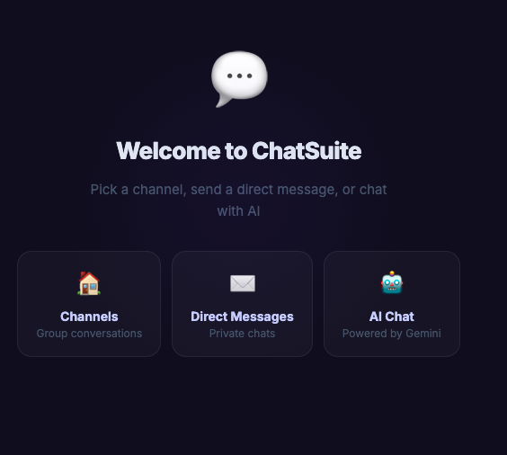
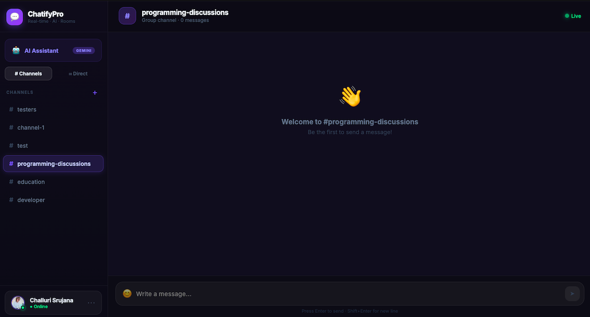

# 💬 ChatSuite

> A modern, real-time chat application with AI integration, group rooms, and direct messaging — built with React and Firebase.

[](https://chatsuite-psi.vercel.app)
[](https://react.dev)
[](https://firebase.google.com)
[](https://vercel.com)

---

<div align="center">

[](https://www.buymeacoffee.com/srujanachalluri)
&nbsp;&nbsp;

[](https://github.com/srujanachalluri/ChatSuite/stargazers)
&nbsp;&nbsp;
[](https://github.com/srujanachalluri/ChatSuite/network)

</div>

## ✨ Features

- 🔐 **Google Authentication** — One-click sign in, no passwords
- 🏠 **Group Chat Rooms** — Create and join #channels, chat in real-time
- ✉️ **Direct Messages** — Private 1-on-1 conversations
- ⚡ **Real-time Messaging** — Powered by Firebase Firestore
- 😊 **Emoji Reactions** — React to any message with 6 emotions
- 🤖 **AI Assistant** — Built-in Gemini AI chat (users bring their own free key)
- 🎨 **Modern Dark UI** — Glassmorphism design with smooth animations
- 📱 **Responsive** — Works on all screen sizes

---

## 🖼️ Screenshots


| Login                          | Chat Room              | AI Assistant         |
| ------------------------------ | ---------------------- | -------------------- |
|  |  |  |

---

| Channels                      | email                     | Emoji                   |
| ----------------------------- | ------------------------- | ----------------------- |
|  |  |  |

---

## 🛠️ Tech Stack

| Layer      | Technology                             |
| ---------- | -------------------------------------- |
| Frontend   | React 18 + Vite                        |
| Styling    | Inline styles + CSS animations         |
| Auth       | Firebase Authentication (Google OAuth) |
| Database   | Firebase Firestore (real-time)         |
| AI         | Google Gemini API (user-provided key)  |
| Animations | CSS keyframes + spring physics         |
| Deployment | Vercel                                 |

---


### Prerequisites

- Node.js v16+
- A Firebase project
- A Google Cloud OAuth app

### 1. Clone the repository

```bash
git clone https://github.com/YOUR_USERNAME/chatsuit.git
cd chatsuite
```

### 2. Install dependencies

```bash
npm install
```

### 3. Set up Firebase

1. Go to [Firebase Console](https://console.firebase.google.com/)
2. Create a new project
3. Enable **Authentication** → Google provider
4. Enable **Firestore Database** 


### 4. Run locally

```bash
npm run dev
```

Open [http://localhost:5173](http://localhost:5173)

--

## 🗺️ Roadmap

- [ ] Push notifications
- [ ] Image sharing (when Firebase Storage free tier is available)
- [ ] Message search
- [ ] Read receipts
- [ ] User presence (typing indicators)
- [ ] Dark/light mode toggle
- [ ] Mobile app (React Native)

---

## 👩‍💻 Author

**Srujana Challuri** — Software Engineer

[](https://github.com/srujanachalluri)
[](https://your-portfolio-url.com)
[](https://linkedin.com/in/your-profile)

---

## 📄 License

MIT License — feel free to use this project for learning or as a portfolio piece.

---

<div align="center">
  <h3>☕ Support This Project</h3>
  <p>If you found ChatSuite useful, consider buying me a coffee!</p>

[](https://www.buymeacoffee.com/srujanachalluri)

  <br/>

  <p>⭐ Don't forget to star this repo if you liked it!</p>

[](https://github.com/srujanachalluri/ChatSuite/stargazers)

</div>

<div align="center">
  <p>Built with ❤️ using React + Firebase</p>
  <p>⭐ Star this repo if you found it useful!</p>
</div>
